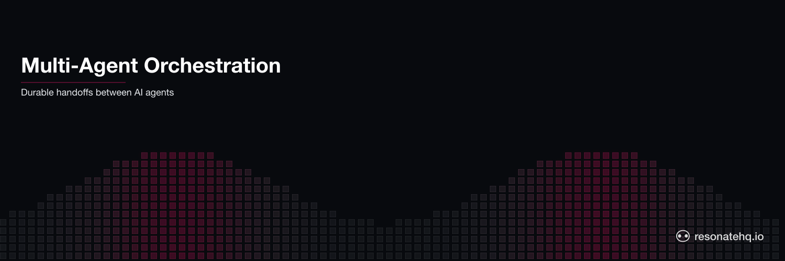

<p align="center">
  <picture>
    <source media="(prefers-color-scheme: dark)" srcset="./assets/banner-dark.png">
    <source media="(prefers-color-scheme: light)" srcset="./assets/banner-light.png">
    
  </picture>
</p>

# Multi-Agent Orchestration

**Resonate Python SDK**

An orchestrator coordinates three specialist AI agents in sequence: researcher collects findings, writer drafts an article, reviewer approves it. Each agent handoff is a durable checkpoint.

If the writer fails mid-generation -- API timeout, crash, rate limit -- Resonate retries it automatically. The researcher does NOT re-run. The orchestrator resumes exactly at the failed step.

## What this demonstrates

- **Sequential agent delegation** -- orchestrator calls researcher -> writer -> reviewer in order
- **Durable handoffs** -- each agent result is cached at its checkpoint; no agent re-runs on partial failure
- **Crash recovery** -- writer fails on first attempt in crash mode, retries without re-running researcher
- **Human-in-the-loop hook** -- natural extension point for approval before publishing (see `src/agent.py`)

## Prerequisites

- Python 3.12+
- [Resonate Server](https://github.com/resonatehq/resonate) running locally
- OpenAI API key

## Setup

```bash
git clone https://github.com/resonatehq-examples/example-multi-agent-orchestration-py
cd example-multi-agent-orchestration-py
uv sync
cp .env.example .env
# Edit .env and set OPENAI_API_KEY
```

## How to run

### 1. Start the Resonate server

```bash
resonate dev
```

### 2. Start the worker

```bash
export OPENAI_API_KEY=sk-...
uv run agent
```

### 3. Invoke the orchestration

In a separate terminal:

**Happy path** -- full pipeline runs to completion:

```bash
resonate invoke orchestration.1 --func orchestrate \
  --arg "The future of durable execution in AI applications" \
  --arg false
```

```
=== Resonate Multi-Agent Orchestration ===
Mode: HAPPY PATH
Topic: "The future of durable execution in AI applications"

Pipeline: researcher -> writer -> reviewer -> [human approval] -> publish

[researcher]  Researching: "The future of durable execution..."...
[researcher]  Complete (312 chars)
[writer]      Writing article (attempt 1)...
[writer]      Complete (487 chars)
[reviewer]    Reviewing draft...
[reviewer]    APPROVED: The article clearly explains the concept...
```

**Crash mode** -- writer fails on first attempt, retries while researcher result is preserved:

```bash
resonate invoke orchestration.crash --func orchestrate \
  --arg "Distributed systems in 2026" \
  --arg true
```

```
[researcher]  Researching: "Distributed systems in 2026"...
[researcher]  Complete (312 chars)
[writer]      Writing article (attempt 1)...
Runtime. Function 'writer' failed with 'RuntimeError: Writer agent connection reset (simulated)' (retrying...)
[writer]      Writing article (attempt 2)...
[writer]      Complete (487 chars)
[reviewer]    Reviewing draft...
[reviewer]    APPROVED: ...
```

Notice: researcher runs once. Writer retries once. Reviewer runs once. The retry message comes from Resonate -- you wrote no retry logic.

## What to observe

1. **Researcher does not re-run on writer failure** -- its result is cached at the `await ctx.run(...)` checkpoint
2. **No retry code in the orchestrator** -- `orchestrate` is pure sequential logic
3. **Each await is a checkpoint** -- crash the worker after any agent call and restart; it resumes from there
4. **Human approval hook** -- see the comment in `src/agent.py` for how to add `ctx.promise()` blocking

## The code

The entire orchestrator is a handful of lines in `src/agent.py`:

```python
async def orchestrate(ctx: Context, topic: str, crash_on_writer: bool = False):
    # Each await is a durable checkpoint
    # If any agent fails, Resonate retries that step only
    findings = await ctx.run(researcher, topic)
    draft    = await ctx.run(writer, topic, findings, crash_on_writer)
    review   = await ctx.run(reviewer, draft)

    # Human-in-the-loop (production pattern):
    #   approval = await ctx.promise()
    #   approved = await approval

    approved = "APPROVED" in review.upper()
    return {
        "status": "published" if approved else "rejected",
        "topic": topic,
        "findings": findings,
        "draft": draft,
        "review": review,
    }
```

## Extending with human-in-the-loop

The orchestrator has a comment showing how to add real human approval. Replace the simulated approval with:

```python
approval = await ctx.promise()
print(f"Waiting for approval. Resolve at: POST /promises/approval/{topic}/resolve")
approved = await approval
```

Then resolve it externally:

```bash
curl -X POST http://localhost:8001/promises/approval/my-topic/resolve \
  -H 'content-type: application/json' \
  -d '{"data": true}'
```

The workflow blocks until the promise is resolved, survives restarts, and works across services.

## File structure

```
example-multi-agent-orchestration-py/
├── src/
│   ├── __init__.py
│   └── agent.py        # researcher, writer, reviewer + orchestrator
├── pyproject.toml
├── .env.example
└── README.md
```

## Why async/await orchestrates three agents

Sequential agent orchestration is often a hosted problem: a platform provides step-level retries, dashboard observability, and an event-based execution model with routing infrastructure. This example solves the narrower problem -- coordinate three specialist agents in order, survive any single agent failure, without leaving the process.

The orchestrator is a few lines of async/await. Each `await ctx.run(agent, ...)` is a durable checkpoint: a crash or API failure retries only that agent. Researcher output is cached at its checkpoint before writer starts; writer output is cached before reviewer starts. There is no retry configuration, no step metadata, no routing schema -- just sequential `await ctx.run` calls.

Human-in-the-loop extends naturally. `await ctx.promise()` blocks the workflow until the promise is resolved externally. The orchestrator survives restarts while waiting; the approval is the checkpoint. No hosted approval surface required.

## Learn more

- [Resonate documentation](https://docs.resonatehq.io)
- [Multi-Agent Orchestration (TypeScript)](https://github.com/resonatehq-examples/example-multi-agent-orchestration-ts)
- [Hacker News Research Agent (Python)](https://github.com/resonatehq-examples/example-hackernews-research-agent-py)
- [Deep Research Agent (Python)](https://github.com/resonatehq-examples/example-openai-deep-research-agent-py)

## License

Apache 2.0
